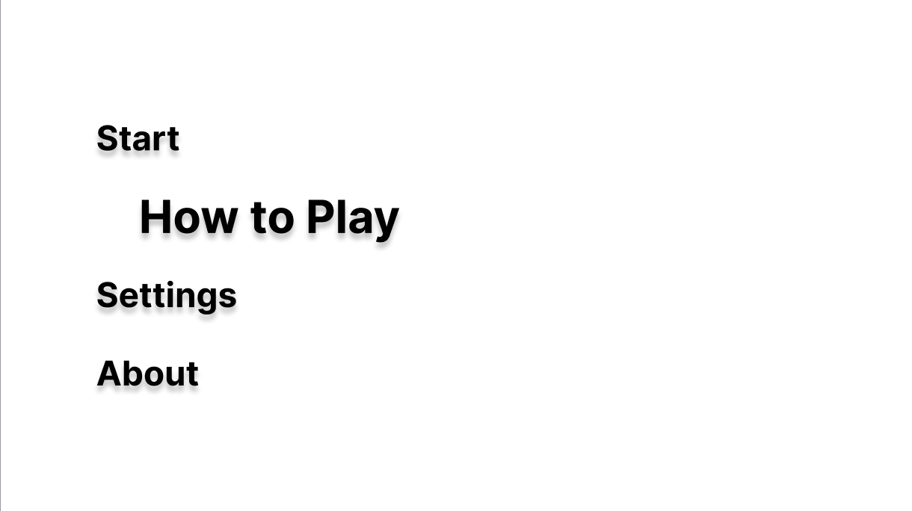
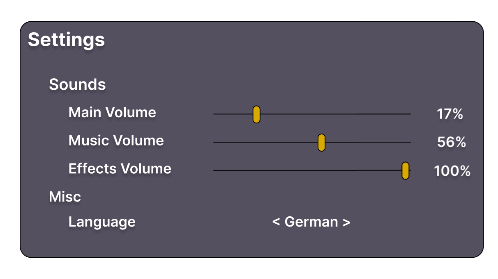
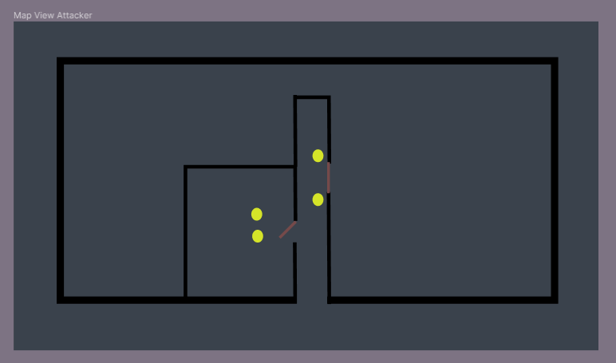
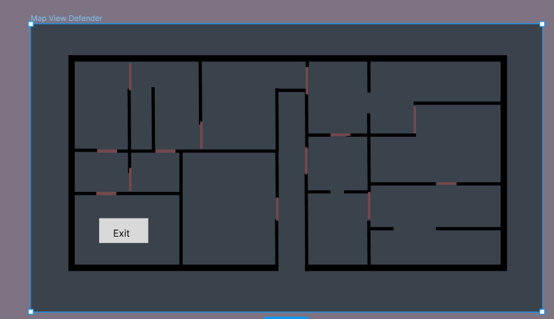
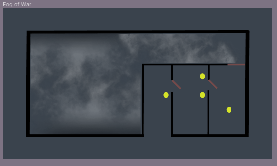
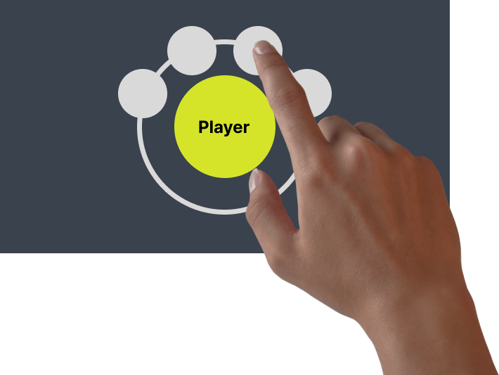
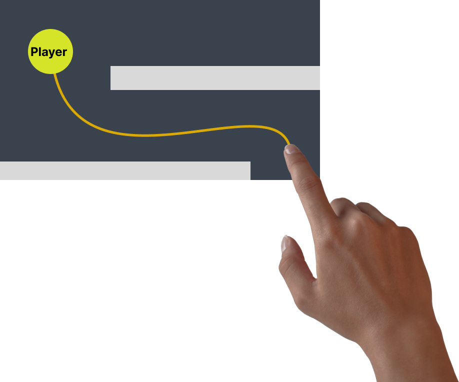

1. # **Introduction**

   ## **1.1 Purpose:**

   This Software Requirements Specification (SRS) describes all specifications for the Game “Project: Highrise”. It includes an overview about this project, detailed information about the planned features and conditions for the development process.

   ## 1.2 Scope:

   The Game will be realised as a Mobile Application.
   The Users can be divided into two Categories: Defending Player and Attacking Player.

   **Planned Subsystems:**

   \- Menu Screen:
   The Menu is an essential part of the UI of a Game. Players can start Games, access Settings and get an overview of the Game’s mechanics.

   \- Settings Screen:
   The Settings are also essential to the Game. The players can things like volume or the language of the Game.

   \- Defense Screen:
   After a game was started in the Menu Screen, the Defense Screen is loaded. Here, the defending player prepares the level for the attacking player by placing obstacles and hostile bots.

   \- Attack Screen:
   After the first player is finished placing everything, the attacking player takes over the device and the Attack Screen is loaded. Here, the attacking player tries to infiltrate and clear each floor of the previously prepared skyscraper.

   ## 1.3 References:

   | **Title** | **Date** | **Publishing organization** |
   | --- | --- | --- |
   | [Blog](https://medium.com/@projecthighrise) | 20.10.2022 | Project: Highrise Team |
   | [GitHub](https://github.com/cesarandr/highrise) | 20.10.2022 | Project: Highrise Team |

   ## 1.4 Overview:

   The following, second chapter provides an overview of this project describing our vision for the Game and an Use-Case-Diagram. The third chapter delivers more details about the specific requirements regarding functionality, usability and design.

   

   

2. # Overall Description

   ## 2.1 Vision:

   Inspired by many great action-strategy games, we plan on developing our own top-down 2D strategy shooter: Project: Highrise! The game has to be played by two players – one attacking and one defending. While the defending player starts the game by barricading different floors of a skyscraper with different obstacles and hostile bots, the attacking player has to try to clear and reconquer the skyscraper’s floors one by one using his own troops. Project: Highrise is a fun game for you and one of your friends testing your strategic and tactical skills. Will you be able to save the skyscraper?!

   ## 2.2 Technology Stack:

   * Game Engine: Godot
   * Development: GdScript
   * Version Control: GitHub / Git
   * Project Management: YouTrack
   * Communication: Discord

     

     

3. # Specific Requirements

   ## 3.1 Functionality
   3\.1.1 Main Menu

   As the device owner who starts the game, I want to be greeted by a simple menu offering me to start the game, view the tutorial, change settings or view information about the game. This should make it quick and easy no navigate to the mentioned entries.

   GUI Mockup:

   {width=70%}

   Preconditions: Godot Project Setup finished
   Post conditions: Each entry needs to lead somewhere
   Effort estimation: 4h

   3\.1.2 Settings

   As the device owner, I want to be able to change basic settings like language and volume in settings menu reachable from the main menu. This is, so that I can easily customize the settings fitting to my preferences.

   GUI Mockup:

   {width=70%}

   Preconditions: Godot Project Setup finished
   Post conditions: Main menu finished, sound setup finished, localized text
   Effort estimation: 4h

   3\.1.3 Map View

   As any player I want to be able to zoom out to see a map, so that I can keep an overview over the whole floor. As a defending player the whole floor should be visible. As an attacking player, only the already visited places are visible.

   GUI Mockup:

   {width=70%}

   {width=599px}

   Preconditions: level generation done
   Post conditions: implement button/gesture in defending and attacking player’s overlay to open map
   Effort estimation: 5h

   3\.1.4. Fog of War

   As an attacker I want to have a good overview of the discovered floors and I want to be able to differentiate them from the undiscovered ones.

   GUI Mockup:

   

   Preconditions: level generation done
   Effort estimation: 4-5h

   3\.1.5. Defending player budget

   In order to limit the amount of obstacles and bots the defending player can place, they have a budget which they have a budget which they can spend on the various available items. This adds to the complexity of the game and makes it even more strategic.

   Preconditions: implemented shop system for defending player
   Effort estimation: 2h

   ## 3.2. Usability:

   3\.2.1. Mobile Touch Inputs

   As any player I want to play the game on mobile, so I can use touch inputs to move my units. By doing that I can react quickly and accurately. This includes drag and drop of units and other things ingame, as well as an overall touch-input-based control system (all buttons, gestures, etc. per touch inputs)

   GUI Mockup:

   {width=70%}

   Preconditions: Units, Buttons, etc. implemented; Input per Godot input library
   Post conditions: Game can be navigated with touch inputs
   Effort estimation: 10-15m per unit

   3\.2.2 Hot Seat Gaming

   The game is being played by two player on one device. The phone is passed from the defending to the attacking player where each one plays his round of either placing obstacles or infiltrating the skyscraper. This kind of gaming is called Hot Seat Gaming (<https://en.wikipedi.org/wiki/Hotseat_(multiplayer_mode)>).

   3/.2.3 Operative Actions 
   As a Player I want to have different actions available to me when selecting one of my operatives, to control my player and best respond to         the ongoing gameplay.
   Actions can be from letting my operative duck behind cover, to throwing grenades.
      
   Preconditions: Basic operative control needs to be implemented
      
   Post conditions: Operatives can be controlled even more precisely
      
   Effort Estimation: 10h
      
   Mockup:

   {width=70%}

   3/.2.4 Operative Movement 
   As a Player I want to move certain operatives along a path through the map, I want to control this path with touch input.
      
   Preconditions: Basic operative control needs to be implemented
      
   Post conditions: Operatives can now be moved separately from each other
      
   Effort Estimation: 10h
      
   Mockup:

   {width=70%}
